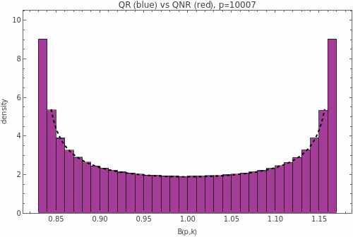
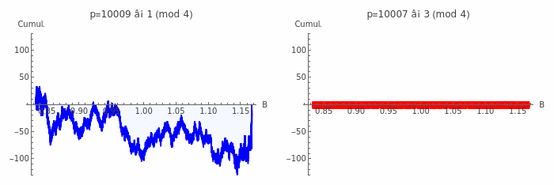

# Session: Primitive Lobe Signs and Number Theory

**Date:** December 3, 2025
**Status:** 🔬 NUMERICALLY VERIFIED

## Summary

Exploration of B(n,k) restricted to primitive indices (where gcd(k,n) = 1) reveals deep connections to classical number theory: Möbius function, Gauss sums, quadratic residues, and Legendre symbols.

## Main Results

### 1. Primitive Lobe Sum Formula

**Theorem:** For n ≥ 2,
$$\sum_{\gcd(k,n)=1} B(n,k) = \varphi(n) + \beta(n) \cdot \mu(n) \cdot \cos\frac{\pi}{n}$$

where:
- $\varphi(n)$ = Euler totient function
- $\mu(n)$ = Möbius function
- $\beta(n) = \frac{\sin(\pi/n) - (\pi/n)\cos(\pi/n)}{2\sin^3(\pi/n)}$

**Proof sketch:**
$$\sum_{\gcd(k,n)=1} B(n,k) = \varphi(n) + \beta(n) \sum_{\gcd(k,n)=1} \cos\frac{(2k-1)\pi}{n}$$

The cosine sum equals $\text{Re}[e^{-i\pi/n} \cdot c_n(1)]$ where $c_n(1) = \mu(n)$ is the Ramanujan sum.

**Numerical verification:** All n from 2 to 100 match exactly.

### 2. Sign Asymmetry for Primes

**Theorem:** For odd prime p, let
$$A(p) = \#\{k : 1 \leq k \leq p-1, B(p,k) > 1\} - \#\{k : 1 \leq k \leq p-1, B(p,k) < 1\}$$

Then:
$$A(p) = \begin{cases} -2 & \text{if } p \equiv 1 \pmod{4} \\ 0 & \text{if } p \equiv 3 \pmod{4} \end{cases}$$

**Interpretation:**
- For $p \equiv 3 \pmod{4}$: lobe signs are perfectly balanced
- For $p \equiv 1 \pmod{4}$: two more lobes are "small" (B < 1) than "large" (B > 1)

**Connection:** This dichotomy reflects that $-1$ is a quadratic residue mod p iff $p \equiv 1 \pmod{4}$.

### 3. Legendre-Weighted B Sum (B-Gauss Connection)

**Theorem:** For odd prime p,
$$\sum_{k=1}^{p-1} \left(\frac{k}{p}\right) B(p,k) = \beta(p) \cdot \sqrt{p} \cdot \begin{cases} \cos(\pi/p) & \text{if } p \equiv 1 \pmod{4} \\ \sin(\pi/p) & \text{if } p \equiv 3 \pmod{4} \end{cases}$$

where $\left(\frac{k}{p}\right)$ is the Legendre symbol.

**Proof:**
$$\sum_{k=1}^{p-1} \left(\frac{k}{p}\right) B(p,k) = \beta(p) \sum_{k=1}^{p-1} \left(\frac{k}{p}\right) \cos\frac{(2k-1)\pi}{p}$$

The cosine sum equals $\text{Re}[e^{-i\pi/p} \cdot G_p]$ where $G_p$ is the quadratic Gauss sum:
$$G_p = \sum_{k=1}^{p-1} \left(\frac{k}{p}\right) e^{2\pi i k/p}$$

Using the classical result $G_p^2 = \left(\frac{-1}{p}\right) p$:
- $p \equiv 1 \pmod{4}$: $G_p = \sqrt{p}$ (real)
- $p \equiv 3 \pmod{4}$: $G_p = i\sqrt{p}$ (purely imaginary)

### 4. Quadratic Residue Distribution

**Observation:** For prime p, comparing B-values over quadratic residues (QR) vs non-residues (QNR):

| p mod 4 | Sum over QR vs QNR | Pattern |
|---------|-------------------|---------|
| 1 | Sum_QR > Sum_QNR | Difference grows with p |
| 3 | Sum_QR ≈ Sum_QNR | Nearly equal |

The difference $\sum_{k \in QR} B(p,k) - \sum_{k \in QNR} B(p,k)$ is always positive but varies with p.

## Connection to RH/GRH

**Question:** Do these results help with the Riemann Hypothesis or Generalized RH?

**Answer:** Not directly.

- The B-Gauss connection is a **finite** sum over k (for fixed p)
- L-functions $L(s, \chi)$ are **infinite** sums over n
- Different mathematical objects

The triviality we found for RH (cosh - sinh = e^{-θ}) applies equally to GRH. The Legendre weighting doesn't escape the fundamental limitation.

**What these results DO show:**
- B(n,k) "knows" about arithmetic structure
- Primitive roots, characters, and reciprocity are encoded in lobe geometry
- The Chebyshev polygon framework connects naturally to classical number theory

## Formulas Summary

| Object | Formula |
|--------|---------|
| Primitive sum | $\sum_{\gcd(k,n)=1} B(n,k) = \varphi(n) + \beta(n) \mu(n) \cos(\pi/n)$ |
| Sign asymmetry | $A(p) = -2 \cdot \mathbf{1}_{p \equiv 1 (4)}$ |
| Legendre-B sum | $\sum (k|p) B(p,k) = \beta(p) \sqrt{p} \cdot \text{trig}(\pi/p)$ |
| Cosine-Gauss | $\sum (k|p) \cos\frac{(2k-1)\pi}{p} = \sqrt{p} \cdot \text{trig}(\pi/p)$ |

## Distribution of B(p,k) as p → ∞

### Limiting behavior of β(p)

$$\beta(p) = \frac{1}{6} + \frac{\pi^2}{15p^2} + O(p^{-4}) \quad \Rightarrow \quad \lim_{p \to \infty} \beta(p) = \frac{1}{6}$$

### Arcsine Distribution

For large p, the values $B(p,1), B(p,2), \ldots, B(p,p-1)$ follow the **arcsine distribution**.

Since $B(p,k) = 1 + \beta(p) \cdot \cos\frac{(2k-1)\pi}{p}$ and the angles become equidistributed:

$$B(p,k) \sim 1 + \frac{1}{6}\cos(U), \quad U \sim \text{Uniform}[0, 2\pi]$$

**Density:** $f(x) = \frac{1}{\pi\sqrt{(x - 5/6)(7/6 - x)}}$ on $[5/6, 7/6] \approx [0.833, 1.167]$

**Moments:**
- Mean: $\mathbb{E}[B] = 1$
- Variance: $\text{Var}[B] = \beta^2/2 \approx 1/72 \approx 0.0139$

### QR vs QNR: Identical Distributions

**Key finding:** Quadratic residues and non-residues have **the same distribution** of B-values.

For p = 10007:
- Mean(QR) = Mean(QNR) = 1.0000
- Var(QR) = Var(QNR) = 0.0139

The Legendre symbol affects **weighted sums** $\sum (k|p) B(p,k)$, but not the **raw distribution**.



## Cumulative Legendre Structure

### Random Walk Behavior

Sorting k by B(p,k) and computing cumulative Legendre sum $\sum_{B(p,j) \leq t} (j|p)$ reveals:

| p mod 4 | Cumulative behavior |
|---------|---------------------|
| 1 | **Random walk** - oscillates ±√p around 0 |
| 3 | **Flat** - stays near 0 throughout |



### Why p ≡ 3 (mod 4) is Flat

For $p \equiv 3 \pmod{4}$, indices with the **same B-value** have **opposite Legendre symbols**.

If $B(p,k) = B(p,k')$ then $(k|p) = -(k'|p)$.

This pairing causes cancellation in the cumulative sum.

### B-Pairing and Half-Factorial

**Observation:** Define $\Pi_B = \prod_{k: B(p,k) > 1} k \pmod{p}$

Then:
$$\left(\frac{p-1}{2}\right)! \equiv (-1)^{(p-1)/2} \cdot \Pi_B \pmod{p}$$

**Verified:** 100% match for first 149 odd primes.

**BUT:** This is algebraically equivalent to the Stickelberger relation!

## Computational Complexity of Sign Determination

### The Sign Problem

The Stickelberger relation says:
$$\left(\frac{p-1}{2}\right)!^2 \equiv (-1)^{(p+1)/2} \pmod{p}$$

This tells us the **square** of the half-factorial, not the value itself:
- $p \equiv 3 \pmod{4}$: result is $\pm 1$
- $p \equiv 1 \pmod{4}$: result is $\pm\sqrt{-1}$

But **WHICH sign?**

### Why It's Computationally Hard

For $p \equiv 3 \pmod{4}$, the sign is determined by the **class number** $h(-p)$:
$$\left(\frac{p-1}{2}\right)! \equiv (-1)^{(h(-p)+1)/2} \pmod{p}$$

**Problem:** Computing $h(-p)$ requires $O(\sqrt{p})$ operations in general.

### Why B-Pairing Doesn't Help

The product $\Pi_B = \prod_{k: B(p,k) > 1} k$ looks geometric, but:

**Where is the "massive multiplication"?**

$\Pi_B$ is the product of indices where $B(p,k) > 1$, i.e., where $\cos\frac{(2k-1)\pi}{p} > 0$.

This happens when $\frac{(2k-1)\pi}{p} < \frac{\pi}{2}$, i.e., $k < \frac{p+1}{4}$.

So: $\Pi_B = \prod_{k=1}^{\lfloor(p-1)/4\rfloor} k = \left\lfloor\frac{p-1}{4}\right\rfloor!$

**Relationship to half-factorial:**

By Wilson's theorem: $(p-1)! \equiv -1 \pmod{p}$

The sets $\{k : B(p,k) > 1\}$ and $\{k : B(p,k) < 1\}$ partition $\{1, \ldots, (p-1)/2\}$ (with some at exactly 1).

Product over these sets relates to $((p-1)/2)!$ through:
$$\prod_{k=1}^{(p-1)/2} k = \left(\frac{p-1}{2}\right)!$$

**Complexity comparison (bit complexity):**

Let $b = \log_2 p$ (number of bits).

| Method | Bit Operations | Notes |
|--------|---------------|-------|
| Direct $((p-1)/2)!$ mod p | $O(p \cdot b^2)$ | $O(p)$ multiplications, each $O(b^2)$ |
| Compute $\Pi_B$ | $O(p \cdot b^2)$ | Same - $O(p/4)$ multiplications mod p |
| Class number $h(-p)$ | $O(\sqrt{p} \cdot b^2)$ | $O(\sqrt{p}) = O(2^{b/2})$ steps |

**Key insight:** $\Pi_B$ involves approximately $p/4$ numbers, each of size $O(\log p)$ bits. Each modular multiplication is $O((\log p)^2)$ using schoolbook, or $O(\log p \cdot \log\log p)$ with FFT-based methods.

**Advantage of mod p computation:**
- Intermediate results stay bounded by $p$ (no exponential blowup)
- But we still need $O(p)$ multiplications to compute the product

**Why class number is "faster" but still hard:**
- $O(\sqrt{p}) = O(2^{b/2})$ is sublinear in p
- But still **exponential** in the bit length $b$
- For cryptographic p (2048+ bits), this is infeasible

**Conclusion:** Our B-pairing gives a **geometric interpretation** of Stickelberger, not a **computational speedup**. Both require $\Theta(p)$ arithmetic operations. The sign determination is fundamentally tied to class numbers - and no known polynomial-time (in $\log p$) algorithm exists.

## Open Questions

1. Is there a direct formula for $\sum_{k \in QR} B(p,k)$ involving class numbers?
2. Can the B-Gauss connection be extended to general Dirichlet characters?
3. ~~Can the B-pairing structure give insight into class number parity without computing $h(-p)$?~~ **Tested: NO** - √p samples in B-order don't predict h mod 4

## Paclet Updates (December 3, 2025)

Updated `Orbit/Kernel/ModularFactorials.wl` with:

### New/Improved Functions

| Function | Description | Complexity |
|----------|-------------|------------|
| `HalfFactorialMod[p]` | ((p-1)/2)! mod p | O(p^{1/4}) for p≡3(mod 4) |
| `HalfFactorialSign[p]` | Sign of half-factorial | O(p^{1/4}) via class number |
| `WilsonFactorialMod[n,p]` | n! mod p via Wilson | O(p-n) |
| `FastFactorialMod[n,p]` | **Unified optimal method** | Auto-selects best algorithm |
| `FactorialCRT[n,k]` | n! mod M via CRT (k primes) | Returns {result, modulus} |
| `FactorialCRT[n,k,"Detailed"->True]` | With individual residues | Returns Association |
| `FactorialRecover[n]` | Full n! recovery via Stirling | Small n only |
| `LegendreExponent[n,p]` | v_p(n!) = power of p in n! | O(log_p(n)) |
| `ReducedFactorialMod[n,p]` | n!/p^v mod p | O(log_p(n)) |

### Performance

For p ≡ 3 (mod 4):
- p = 10^6: **12x speedup**
- p = 10^7: **32x speedup**
- p = 2^61-1: **Works via PARI/GP fallback!**

Uses Stickelberger relation + Shanks algorithm for class number.

### FactorialCRT Example

```mathematica
(* For n = 10^6 (factorial has 5.5 million digits!) *)
{result, modulus} = FactorialCRT[10^6, 30];
(* Time: ~0.8 seconds *)
(* modulus has 180 digits *)

(* Detailed output *)
detail = FactorialCRT[100, 5, "Detailed" -> True];
detail["Primes"]    (* {101, 103, 107, 109, 113} *)
detail["Residues"]  (* {100, 51, 48, 11, 80} *)
detail["Methods"]   (* which algorithm was used per prime *)
```

### ReducedFactorialMod for small primes

For primes p < n, while n! ≡ 0 (mod p), we can compute the **p-reduced factorial**:

$$\frac{n!}{p^{v_p(n!)}} \mod p$$

This is useful for:
- Computing n! mod p^k (lifting)
- Theoretical analysis of factorial structure
- **Not directly usable in FactorialCRT** (different residue system)

The smooth/rough factorization approach is possible but complex:
- Smooth part: $\prod p^{v_p(n!)}$ for small primes (huge number)
- Rough part: n!/smooth via CRT on reduced factorials
- Limited practical benefit since smooth part dominates

### PARI/GP Fallback

For very large primes where Mathematica's `NumberFieldClassNumber` overflows (p > 2^50), the paclet now falls back to PARI/GP's `qfbclassno`:

```mathematica
HalfFactorialMod[2^61 - 1]
(* HalfFactorialMod::pari: Using PARI/GP for large prime p = 2305843009213693951. *)
(* Returns: 2305843009213693950 = -1 mod (2^61-1) *)
```

## Code Snippets

```mathematica
(* B function *)
beta[n_] := (Sin[Pi/n] - Pi/n Cos[Pi/n]) / (2 Sin[Pi/n]^3)
B[n_, k_] := 1 + beta[n] * Cos[(2k-1) Pi/n]

(* Primitive sum *)
primSum[n_] := Sum[If[GCD[k,n] == 1, B[n,k], 0], {k, 1, n}]

(* Verify formula *)
predicted[n_] := EulerPhi[n] + beta[n] * MoebiusMu[n] * Cos[Pi/n]

(* Sign asymmetry for prime p *)
asymmetry[p_] := Module[{signs},
  signs = Sign[B[p, #] - 1] & /@ Range[p-1];
  Count[signs, 1] - Count[signs, -1]
]

(* Legendre-weighted sum *)
legendreB[p_] := Sum[JacobiSymbol[k, p] * B[p, k], {k, 1, p-1}]
```

## Files

- `README.md` - This documentation
