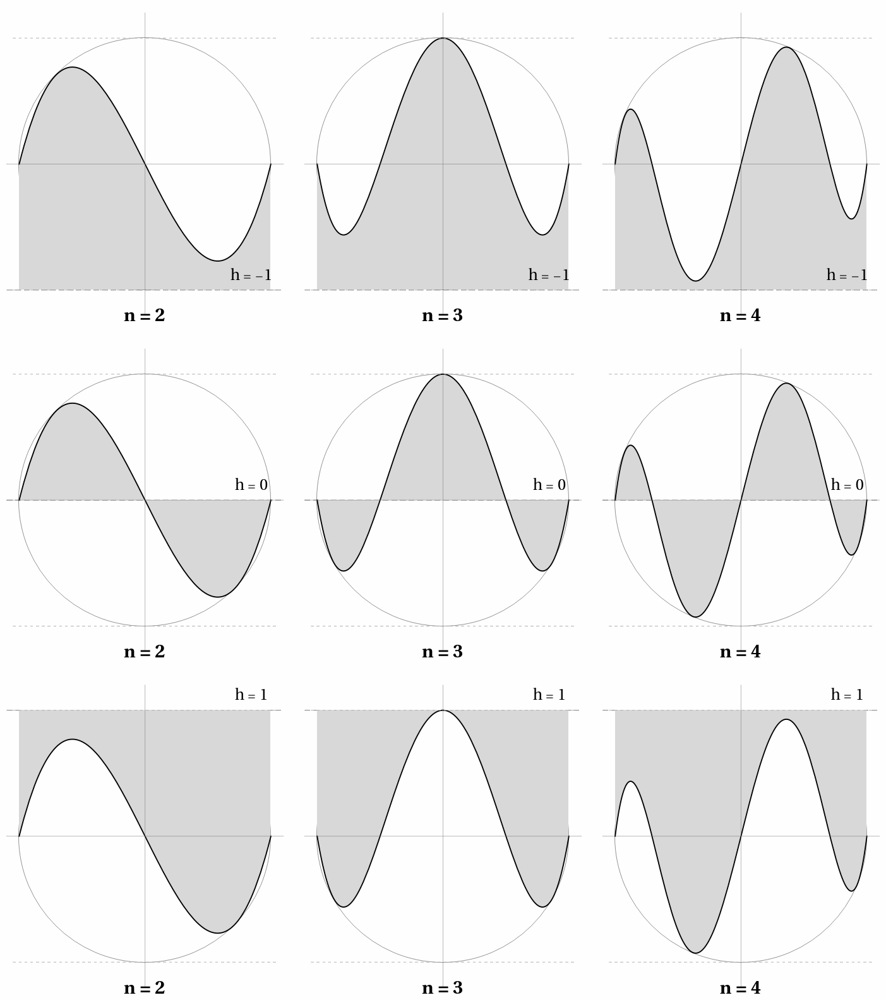
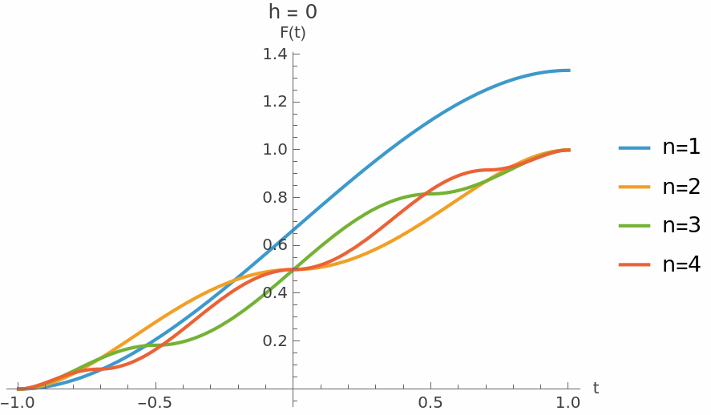
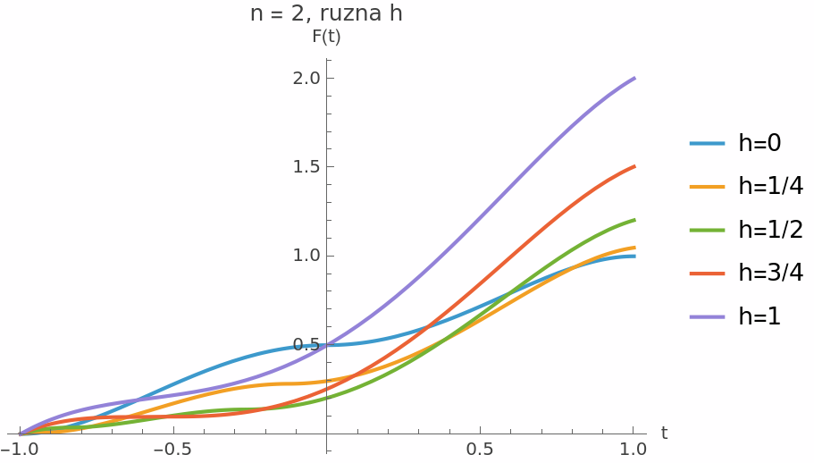

# Chebyshev Integral Identity

**Date:** December 7, 2025
**Status:** Numerically verified, algebraically proven

## Core Function

Define the Chebyshev difference function:

$$f_n(x) = T_{n+1}(x) - x \cdot T_n(x)$$

where $T_n$ is the Chebyshev polynomial of the first kind.

### Key Identity

$$f_n(x) = \frac{T_{n+1}(x) - T_{n-1}(x)}{2} \quad (n \geq 1)$$

In trigonometric form with $x = \cos\theta$:

$$f_n(\cos\theta) = -\sin\theta \cdot \sin(n\theta)$$

### Fundamental Bound

$$|f_n(x)| \leq 1 \quad \text{for all } x \in [-1, 1], n \geq 1$$

## Main Invariant Theorem (h = 0)

**Theorem:** For all $n \geq 2$:

$$\int_{-1}^{1} |f_n(x)| \, dx = 1$$

This is the **non-trivial** result: despite $|f_n|$ being a piecewise function (with $n$ sign changes), the integral is independent of $n$.

For $n = 1$: $\int |f_1| = 4/3$ (special case).

### Why This Is Non-Trivial

The function $f_n$ has zeros at $x_k = \cos(k\pi/n)$ for $k = 0, 1, \ldots, n$, so $|f_n|$ is genuinely piecewise—the absolute value does **not** simplify to a single polynomial.

## Trivial Generalization (h ≠ 0)

For $|h| \geq 1$, the absolute value **disappears** due to the bound $|f_n| \leq 1$:

$$\int_{-1}^{1} |f_n(x) - h| \, dx + \int_{-1}^{1} |f_n(x) + h| \, dx = 4h$$

**Proof (trivial):**
Since $|f_n| \leq 1$ and $h \geq 1$:
- $f_n - h \leq 0$ always → $|f_n - h| = h - f_n$
- $f_n + h \geq 0$ always → $|f_n + h| = f_n + h$

Sum: $(h - f_n) + (f_n + h) = 2h$, integral over $[-1,1]$: $4h$. $\square$

This is just integration of a polynomial—no genuine use of absolute value.

## Cumulative Integral Functions

Define the cumulative integral:

$$F_n^{(h)}(t) = \int_{-1}^{t} |f_n(x) - h| \, dx$$

### Key Insight: Absolute Value Disappears

The remarkable feature is that for $h = \pm 1$, the **absolute value linearizes** due to the bound $|f_n| \leq 1$:

**For $h = 1$:**
Since $f_n(x) \leq 1$ everywhere on $[-1, 1]$:
$$f_n(x) - 1 \leq 0 \quad \Rightarrow \quad |f_n(x) - 1| = 1 - f_n(x)$$

Therefore:
$$F_n^{(1)}(t) = \int_{-1}^{t} |f_n - 1| \, dx = \int_{-1}^{t} (1 - f_n) \, dx = (t+1) - \int_{-1}^{t} f_n \, dx$$

**For $h = -1$:**
Since $f_n(x) \geq -1$ everywhere:
$$f_n(x) + 1 \geq 0 \quad \Rightarrow \quad |f_n(x) + 1| = f_n(x) + 1$$

Therefore:
$$F_n^{(-1)}(t) = \int_{-1}^{t} (1 + f_n) \, dx = (t+1) + \int_{-1}^{t} f_n \, dx$$

**For $h = 0$:**
Here $f_n(x)$ changes sign on $[-1, 1]$, so the absolute value does **not** simplify—the result is a piecewise polynomial.

### Primitive Function

Using the definite integral $\int_{-1}^{t} f_n \, dx = G_n(t) - G_n(-1)$, we get:

$$F_n^{(1)}(t) = (t+1) - G_n(t) + G_n(-1)$$
$$F_n^{(-1)}(t) = (t+1) + G_n(t) - G_n(-1)$$

The primitive function $G_n$ has the closed Chebyshev form:

$$G_n(x) = \int f_n(x) \, dx = \frac{T_{n+2}(x)}{4(n+2)} - \frac{T_n(x)}{2n} + \frac{T_{n-2}(x)}{4(n-2)} \quad (n \geq 3)$$

### Derivation of $G_n$ via Chebyshev Identities

The formula follows from standard Chebyshev identities:

1. **Product rule:** $x \cdot T_n(x) = \frac{T_{n+1}(x) + T_{n-1}(x)}{2}$

2. **Therefore:** $f_n(x) = T_{n+1} - x \cdot T_n = \frac{T_{n+1} - T_{n-1}}{2}$

3. **T-U connection:** $\frac{T_{n+1} - T_{n-1}}{2} = (x^2 - 1) \cdot U_{n-1}(x)$

4. **Integral of $T_n$:** $\int T_n \, dx = \frac{T_{n+1}}{2(n+1)} - \frac{T_{n-1}}{2(n-1)} + C \quad (n \geq 2)$

Combining (2) and (4):
$$G_n = \frac{1}{2}\left[\int T_{n+1} - \int T_{n-1}\right] = \frac{T_{n+2}}{4(n+2)} - \frac{T_n}{2n} + \frac{T_{n-2}}{4(n-2)}$$

**Note:** For $|h| \geq 1$, the absolute value disappears, so this is just standard polynomial integration—nothing surprising.

### Closed Loop (Trivial)

For $h = 1$, subtracting the linear part gives:

$$F_n^{(1)}(t) - (t+1) = -G_n(t) + G_n(-1)$$

Taking the derivative:

$$\frac{d}{dt}\left[F_n^{(1)}(t) - (t+1)\right] = -G_n'(t) = -f_n(t)$$

This creates a **closed loop in Chebyshev space**:

```
                T_{n+1}, T_{n-1}
                      │
                      ▼
    f_n(x) = (T_{n+1} - T_{n-1})/2
                      │
                      │  ∫|· - 1| dx
                      ▼
    F_n^{(1)}(t) = (t+1) + combination of T_{n+2}, T_n, T_{n-2}
                      │
                      │  subtract (t+1), differentiate
                      ▼
    -f_n(t) = -(T_{n+1} - T_{n-1})/2
                      │
                      ▼
                T_{n+1}, T_{n-1}
```

| Stage | Chebyshev indices |
|-------|-------------------|
| Input $f_n$ | $T_{n-1}, T_{n+1}$ |
| Output $F_n^{(1)} - (t+1)$ | $T_{n-2}, T_n, T_{n+2}$ |
| After differentiation | $T_{n-1}, T_{n+1}$ |

**Note:** This is trivial—integration shifts Chebyshev indices by ±1 (known property), and the absolute value simply disappears for $|h| \geq 1$. The "closed loop" is just: integrate then differentiate = identity.

### Case h = 1

Final values:

| n | $F_n^{(1)}(1)$ |
|---|----------------|
| 1 | 10/3 |
| 2 | 2 |
| 3 | 26/15 |
| 4 | 2 |
| 5 | 206/105 |
| even $\geq 2$ | 2 |

### Case h = -1

$$F_n^{(-1)}(t) = (t+1) + G_n(t) - G_n(-1)$$

By the invariant theorem: $F_n^{(1)}(1) + F_n^{(-1)}(1) = 4$ for all $n$.

### Case h = 0

$$F_n^{(0)}(t) = \int_{-1}^{t} |f_n(x)| \, dx$$

This is piecewise polynomial with breakpoints at zeros of $f_n$:

$$\text{Zeros of } f_n: \quad x_k = \cos\left(\frac{k\pi}{n}\right), \quad k = 0, 1, \ldots, n$$

Final values:

| n | $F_n^{(0)}(1)$ |
|---|----------------|
| 1 | 4/3 |
| $\geq 2$ | 1 |

## Boundary Values $G_n(-1)$

### Odd n

For $n = 1$:
$$G_1(-1) = \frac{2}{3}$$

For odd $n \geq 3$:
$$G_n(-1) = \frac{-2}{(n-2) \cdot n \cdot (n+2)}$$

Examples: $-2/15$ (n=3), $-2/105$ (n=5), $-2/315$ (n=7)

### Even n = 2m

For odd $m$ (i.e., $n \equiv 2 \pmod{4}$):
$$G_n(-1) = \frac{(-1)^m}{n}$$

For even $m$ (i.e., $n \equiv 0 \pmod{4}$):
$$G_n(-1) = \frac{(-1)^m \cdot (m/2)}{m^2 - 1}$$

| n | m | G_n(-1) |
|---|---|---------|
| 2 | 1 | -1/2 |
| 4 | 2 | 1/3 |
| 6 | 3 | -1/6 |
| 8 | 4 | 2/15 |
| 10 | 5 | -1/10 |
| 12 | 6 | 3/35 |

### Symmetry Property

- **Even n:** $G_n(-1) = G_n(1)$, hence $\int_{-1}^{1} f_n = 0$
- **Odd n:** $G_n(-1) = -G_n(1)$, hence $\int_{-1}^{1} f_n = 2G_n(1)$

## Non-Invariance for 0 < |h| < 1

For $0 < h < 1$, the sum $\int |f_n - h| + \int |f_n + h|$ is **not** n-independent.

The total is an algebraic (generally irrational) number:

| h | n=1 | n=2 | Structure |
|---|-----|-----|-----------|
| 1/2 | $(6 + 2\sqrt{2})/3$ | Root of degree-6 polynomial | Irrational |
| 1/4 | $1 + \sqrt{3}$ | Root of degree-6 polynomial | Irrational |

**Reason:** Zeros of $f_n(x) = h$ are algebraic numbers (roots of Chebyshev polynomial equations), leading to irrational integrals.

## Explicit Cumulative Formulas

### For h = 1

| n | $F_n^{(1)}(t)$ |
|---|----------------|
| 1 | $\frac{5}{3} + 2t - \frac{t^3}{3}$ |
| 2 | $\frac{1}{2} + t + t^2 - \frac{t^4}{2}$ |
| 3 | $\frac{13}{15} + \frac{5t^3}{3} - \frac{4t^5}{5}$ |
| 4 | $\frac{4}{3} + t - 2t^2 + 3t^4 - \frac{4t^6}{3}$ |

### For h = -1

| n | $F_n^{(-1)}(t)$ |
|---|-----------------|
| 1 | $\frac{1}{3} + \frac{t^3}{3}$ |
| 2 | $\frac{3}{2} + t - t^2 + \frac{t^4}{2}$ |
| 3 | $\frac{17}{15} + 2t - \frac{5t^3}{3} + \frac{4t^5}{5}$ |
| 4 | $\frac{2}{3} + t + 2t^2 - 3t^4 + \frac{4t^6}{3}$ |

## Connection to Earlier Work

This integral identity complements the signed Chebyshev theorem from the session 2025-12-05:

$$\int_{-1}^{1} \text{sgn}(U_{n-1}(x)) \cdot T_n(x) \, dx = 0$$

Both results exploit the oscillatory structure of Chebyshev polynomials and their bounded behavior on $[-1, 1]$.

## Visualizations

### Why h = ±1 are special



The shaded area represents $\int |f_n(x) - h| \, dx$:
- **h = -1** (top row): $f_n \geq -1$ always, so $|f_n + 1| = f_n + 1$ (no sign changes)
- **h = 0** (middle row): $f_n$ crosses zero, so $|f_n|$ is piecewise
- **h = 1** (bottom row): $f_n \leq 1$ always, so $|f_n - 1| = 1 - f_n$ (no sign changes)

This illustrates why the closed loop in Chebyshev space works only for $h = \pm 1$.

### Cumulative integral for h = 0



Note: For $n \geq 2$, all curves converge to $F(1) = 1$.

### Cumulative integral for n = 2, varying h



Note: $h = 0$ gives $F(1) = 1$, $h = 1$ gives $F(1) = 2$.

## Summary

| Property | h = 0 | h = 1 | h = -1 | 0 < h < 1 |
|----------|-------|-------|--------|-----------|
| $F_n(1)$ | 1 (n≥2) | varies | varies | varies |
| $F_n^{(h)} + F_n^{(-h)}$ at $t=1$ | 2 | 4 | 4 | varies with n |
| Rationality | Yes | Yes | Yes | Algebraic (irrational) |
| n-independent total | Yes (n≥2) | Yes | Yes | No |

## Proof of the Main Invariant (h = 0)

### Trigonometric Reduction

Using $x = \cos\theta$ and $f_n(\cos\theta) = -\sin\theta \cdot \sin(n\theta)$:

$$\int_{-1}^{1} |f_n(x)| \, dx = \int_0^\pi \sin^2\theta \cdot |\sin(n\theta)| \, d\theta$$

(The $\sin^2\theta$ comes from $|f_n| \cdot |dx/d\theta| = |\sin\theta \sin(n\theta)| \cdot \sin\theta$.)

### Decomposition

Using $\sin^2\theta = \frac{1 - \cos(2\theta)}{2}$:

$$\int_0^\pi \sin^2\theta \, |\sin(n\theta)| \, d\theta = \frac{1}{2} \int_0^\pi |\sin(n\theta)| \, d\theta - \frac{1}{2} \int_0^\pi \cos(2\theta) \, |\sin(n\theta)| \, d\theta$$

### First Integral

$$\int_0^\pi |\sin(n\theta)| \, d\theta = 2$$

**Proof:** On $[0, \pi]$, $\sin(n\theta)$ completes $n$ half-periods. Each half-period contributes $\int_0^{\pi/n} \sin(n\theta) \, d\theta = \frac{2}{n}$. Total: $n \cdot \frac{2}{n} = 2$.

### Second Integral (Orthogonality)

$$\int_0^\pi \cos(2\theta) \, |\sin(n\theta)| \, d\theta = 0 \quad \text{for } n \geq 2$$

This is an orthogonality relation: the "frequency-2" function $\cos(2\theta)$ is orthogonal to $|\sin(n\theta)|$ for $n \geq 2$.

### Conclusion

$$\int_{-1}^{1} |f_n(x)| \, dx = \frac{1}{2} \cdot 2 - \frac{1}{2} \cdot 0 = 1 \quad \text{for } n \geq 2$$

### Special Case n = 1

For $n = 1$: $|\sin\theta| = \sin\theta$ on $[0, \pi]$, so:

$$\int_0^\pi \sin^3\theta \, d\theta = \frac{4}{3}$$

This explains why $\int |f_1| = \frac{4}{3} \neq 1$.

## Partial Integrals Between Roots

The zeros of $f_n$ in $(-1, 1)$ are $x_k = \cos(k\pi/n)$ for $k = 1, \ldots, n-1$. We can compute partial integrals between consecutive roots.

### Rationality of Partial Integrals

**Observation:** For $n \in \{2, 3, 4, 6\}$, **all** partial integrals $\int_{x_{k+1}}^{x_k} |f_n| \, dx$ are **rational**.

For $n \geq 5$ (except $n = 6$), some partial integrals are **irrational**.

| n | All partials rational? | Reason |
|---|------------------------|--------|
| 2 | ✓ YES | Root at 0 (rational) |
| 3 | ✓ YES | Roots at ±1/2 (rational) |
| 4 | ✓ YES | Primitive $F_4$ cancels √2 |
| 5 | no | √5 appears |
| 6 | ✓ YES | Primitive $F_6$ cancels √3 |
| 7+ | no | Transcendental cos(π/n) persists |

### Special Case: n = 3 Has Rational Roots

Unlike most odd $n$, the roots for $n = 3$ are:
- $\cos(\pi/3) = 1/2$
- $\cos(2\pi/3) = -1/2$

This makes n = 3 behave like the "even" cases regarding rationality.

### Partial Integrals Data (n = 2..6)

**n = 2:** (roots: 0)
| Interval | Value |
|----------|-------|
| $[-1, 0]$ | 1/2 |
| $[0, 1]$ | 1/2 |
| **Total** | **1** |

**n = 3:** (roots: -1/2, 1/2)
| Interval | Value |
|----------|-------|
| $[-1, -1/2]$ | 11/60 |
| $[-1/2, 1/2]$ | 19/30 |
| $[1/2, 1]$ | 11/60 |
| **Total** | **1** |

**n = 4:** (roots: $-\sqrt{2}/2$, 0, $\sqrt{2}/2$)
| Interval | Value |
|----------|-------|
| $[-1, -\sqrt{2}/2]$ | 1/12 |
| $[-\sqrt{2}/2, 0]$ | 5/12 |
| $[0, \sqrt{2}/2]$ | 5/12 |
| $[\sqrt{2}/2, 1]$ | 1/12 |
| **Total** | **1** |

**n = 5:** (roots involve golden ratio $\phi$)
| Interval | Value |
|----------|-------|
| outer | $(93 - 25\sqrt{5})/840$ |
| inner | 109/420 |
| middle | $(109 + 25\sqrt{5})/420$ |
| **Total** | **1** |

**n = 6:** (roots: $-\sqrt{3}/2$, -1/2, 0, 1/2, $\sqrt{3}/2$)
| Interval | Value |
|----------|-------|
| $[-1, -\sqrt{3}/2]$ | 5/192 |
| $[-\sqrt{3}/2, -1/2]$ | 1/6 |
| $[-1/2, 0]$ | 59/192 |
| $[0, 1/2]$ | 59/192 |
| $[1/2, \sqrt{3}/2]$ | 1/6 |
| $[\sqrt{3}/2, 1]$ | 5/192 |
| **Total** | **1** |

### Cyclotomic Characterization

**Theorem:** All lobe areas are rational if and only if $n \in \{2, 3, 4, 6\}$.

**Equivalent characterizations:**

1. **Euler totient:** $\varphi(n) \leq 2$
2. **Algebraic:** $\cos^2(k\pi/n)$ is rational for all $k = 1, \ldots, n-1$
3. **Field-theoretic:** The real cyclotomic field $\mathbb{Q}(\cos(2\pi/n))$ has degree $\leq 2$ over $\mathbb{Q}$

| n | $\varphi(n)$ | All lobes rational? |
|---|--------------|---------------------|
| 2 | 1 | ✓ |
| 3 | 2 | ✓ |
| 4 | 2 | ✓ |
| 5 | 4 | ✗ |
| 6 | 2 | ✓ |
| 7+ | ≥4 | ✗ |

### Counterexample: Rational Roots Don't Imply Rational Areas

**n = 9** has rational roots at $k = 3, 6$ (where $\cos(3\pi/9) = 1/2$ and $\cos(6\pi/9) = -1/2$), but **all** lobe areas are irrational.

**Why:** The lobe area formula involves $\cos^2(k\pi/n)$ for ALL internal roots, not just the rational ones. Even one irrational $\cos^2$ value "contaminates" the Fourier sum.

### The 1/π Invariant Extends to All Real n

The total integral $\int_0^n A(n,k) \, dk = 1$ holds for **all** $n > 2$, including:
- Half-integers: $n = 5/2, 7/2, 9/2, \ldots$
- Rationals: $n = 3/2, 4/3, \ldots$
- Irrationals: $n = \pi, e, \sqrt{2}, \ldots$

This is because the lobe area decomposes as:
$$A(n,k) = \frac{1}{n} + \beta(n) \cos\left(\frac{(2k-1)\pi}{n}\right)$$

The DC component integrates to 1, and the oscillatory part integrates to 0.

### Expression via Symmetrized circ Function

Using the symmetrized goniometric function from the beta-functions analysis:

$$\text{circ}(t) = 1 - 2\sin^2\left(\frac{\pi}{2}\left(\frac{3}{4} + t\right)\right) = \cos\left(\frac{3\pi}{4} + \pi t\right)$$

We can express:

$$\cos^2\left(\frac{k\pi}{n}\right) = \frac{1 + \text{circ}\left(\frac{5}{4} - \frac{2k}{n}\right)}{2}$$

**Key insight:** The argument $\frac{5}{4} - \frac{2k}{n}$ is always rational for integer $k, n$.

**Rationality criterion:** $\cos^2(k\pi/n)$ is rational iff $\text{circ}\left(\frac{5}{4} - \frac{2k}{n}\right)$ is rational.

Since $\text{circ}(r) = \cos(3\pi/4 + \pi r)$, rationality occurs when $3\pi/4 + \pi r$ is a multiple of $\pi/3$ or $\pi/2$ (the "good" angles where cosine is rational: $0, \pm 1/2, \pm 1$).

| n | Arguments $\frac{5}{4} - \frac{2k}{n}$ | circ values | All rational? |
|---|----------------------------------------|-------------|---------------|
| 2 | 1/4 | −1 | ✓ |
| 3 | 7/12, −1/12 | −1/2, −1/2 | ✓ |
| 4 | 3/4, 1/4, −1/4 | 0, −1, 0 | ✓ |
| 5 | 17/20, 9/20, ... | $(\sqrt{5}-1)/4$, ... | ✗ |
| 6 | 11/12, 7/12, 1/4, −1/12, −5/12 | 1/2, −1/2, −1, −1/2, 1/2 | ✓ |

### Signaling Interpretation

The rationality of **all** lobe areas signals special cyclotomic structure. The set $\{2, 3, 4, 6\}$ corresponds to regular polygons constructible with compass and straightedge using only the simplest algebraic extensions (no surds beyond $\sqrt{2}$ and $\sqrt{3}$ in the squared form).

In the circ language: these are exactly the $n$ for which all arguments $\frac{5}{4} - \frac{2k}{n}$ (for $k = 1, \ldots, n-1$) map to "good" cosine values under the transformation $t \mapsto \cos(3\pi/4 + \pi t)$.

## Open Question: Structure for h ∈ (-1, 1)

For $0 < |h| < 1$, the integral $\int |f_n - h|$ depends on $n$. Is there interesting structure in the triple $(h, n, \text{integral})$?

Numerical data:

| h | n=2 | n=3 | n=4 | n=5 |
|---|-----|-----|-----|-----|
| 0 | 1.000 | 1.000 | 1.000 | 1.000 |
| 1/4 | 1.048 | 1.041 | 1.056 | 1.050 |
| 1/2 | 1.203 | 1.166 | 1.252 | 1.203 |
| 3/4 | 1.504 | 1.384 | 1.567 | 1.485 |

The values are algebraic (generally irrational) numbers. Whether there's a pattern remains unexplored.
