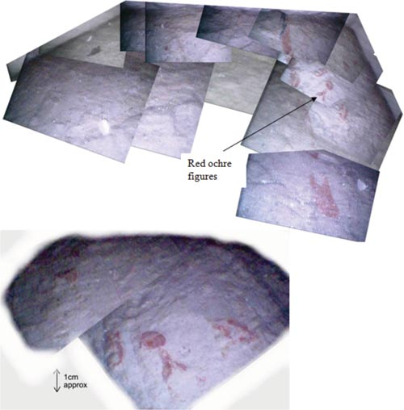
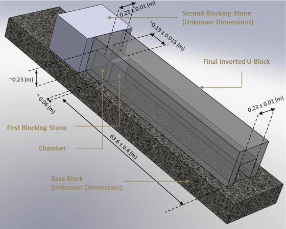

# Djedi Project: Queen's Chamber Shaft Exploration

**Discovery date:** May 2011
**Status:** ⏸️ SUSPENDED (Egyptian Revolution)

---

## Overview

The Djedi Project was an international robotic expedition to explore the narrow shafts of the Queen's Chamber in the Great Pyramid of Giza. The robot successfully traveled 63.6 m through a 20×20 cm shaft and deployed a snake camera through a hole in the "Gantenbrink Door" — revealing hieroglyphs unseen since the pyramid's construction (~2560 BC).

## Team

| Role | Organization |
|------|--------------|
| Robot design | University of Leeds (Prof. Rob Richardson) |
| Project management | Scoutek Ltd (Shaun Whitehead) |
| Sponsor | Dassault Systèmes, France |
| Egyptian authority | Supreme Council of Antiquities (Zahi Hawass) |

## Technical Specifications

### Robot

| Parameter | Value |
|-----------|-------|
| Weight | 5 kg |
| Locomotion | Inchworm motion |
| Shaft dimensions | 20 × 20 cm (smaller than A4 paper) |
| Climb distance | 63.6 m at 40° incline |
| Development time | 5 years |

### Snake Camera

| Parameter | Value |
|-----------|-------|
| **Diameter** | < 8 mm |
| Focusing | None (fixed wide-angle lens) |
| Depth of field | 2-12 cm |
| Exposure | Fixed (no adjustment possible) |
| Field of view | 78° |
| Movement range | ±150° horizontal/vertical |

**Limitations explicitly noted in paper:**
> *"The camera resolution could be improved and at times electrical noise caused the pictures to degrade."*

## Discoveries

### 1. Red Ochre Markings ("Hieroglyphs")

*Figure: Composite of chamber floor showing red ochre figures. Bottom shows detail with 1cm scale.*

- **Location:** Floor of chamber between first and second blocking stones
- **Material:** Red ochre (natural pigment)
- **Status:** **UNDECIPHERED**
- **Interpretation:** Likely worker's marks or ritualistic symbols

### 2. Copper Pin Configuration

The snake camera revealed that the copper "handles" on the blocking stone:
- Curve back on themselves (loop shape)
- Appear **decorative**, not functional
- Inner surface of door is **polished** — suggests ritual purpose

### 3. Chamber Dimensions

| Dimension | Value |
|-----------|-------|
| Distance from entrance | 63.6 ± 0.4 m |
| Chamber width | ~23 cm |
| Chamber depth | ~19 cm |
| First blocking stone thickness | ~60 mm |

### 4. Mason's Mark in Shaft

*Figure: Camera images during ascent. Frame (E) shows red mason's mark on left wall.*

## Project Suspension

### Timeline

| Date | Event |
|------|-------|
| 2009 | Preliminary studies |
| May 2011 | Successful exploration, hieroglyphs discovered |
| **Jan 2011** | **Egyptian Revolution begins** |
| 2011-present | Project suspended |

### Planned (Never Realized) Improvements

1. **Larger snake camera** with higher resolution
2. **HD video camera** onboard rover
3. **Sonic surveyor** to measure second blocking stone thickness
4. **Northern shaft exploration**

> *"Now that the positioning of the existing hole is known, it is possible to make the snake camera slightly larger, allowing higher resolution and more illumination."*
> — Richardson et al., 2013

## Why the Poor Image Quality?

| Factor | Impact |
|--------|--------|
| 8mm camera diameter | Tiny sensor, limited optics |
| No focusing mechanism | Fixed depth of field |
| Fixed exposure | Over/underexposure depending on position |
| 64m tether | Electrical noise degraded signal |
| Political situation | No opportunity for upgraded equipment |

## Open Questions

1. **What do the red ochre markings mean?**
   - Worker identification?
   - Ritual symbols?
   - Construction instructions?

2. **What lies behind the second blocking stone?**
   - Another chamber?
   - Solid rock?
   - The "Big Void" detected by muon tomography (2017)?

3. **What about the northern shaft?**
   - Similar door discovered by Pyramid Rover (2002)
   - Never explored by Djedi

## Sources

### Primary

- Richardson, R. et al. (2013). *"The 'Djedi' Robot Exploration of the Southern Shaft of the Queen's Chamber in the Great Pyramid of Giza, Egypt"*. Journal of Field Robotics, 30(3), 323-348. DOI: 10.1002/rob.21451
  - Local copy: `papers/djedi-robot-2013.pdf`

### Media Coverage

- [NBC News: Robot finds hidden hieroglyphs inside pyramid](https://www.nbcnews.com/id/wbna43183094) (May 2011)
- [University of Leeds: The robot opening a window on an ancient civilisation](https://www.leeds.ac.uk/news-technology/news/article/4548/the-robot-opening-a-window-on-an-ancient-civilisation)

### Related

- [Djedi Project - Wikipedia](https://en.wikipedia.org/wiki/Djedi_Project)
- [Star shaft - Wikipedia](https://en.wikipedia.org/wiki/Star_shaft)

---

## Images

All images in `figures/djedi/`:

| File | Description |
|------|-------------|
| `red-ochre-figures.jpg` | Chamber floor composite with hieroglyphs (from paper) |
| `shaft-ascent.jpg` | Camera images during 63.6m climb |
| `chamber-3d-reconstruction.jpg` | 3D model of chamber structure |
| `floor-composite-nbc.jpg` | NBC News version (lower quality) |

---

**Note:** This represents one of the most tantalizing archaeological mysteries of the 21st century — hieroglyphs that no human has seen for 4,500 years, captured on camera but too blurry to read, with the project to improve image quality halted by political upheaval.
