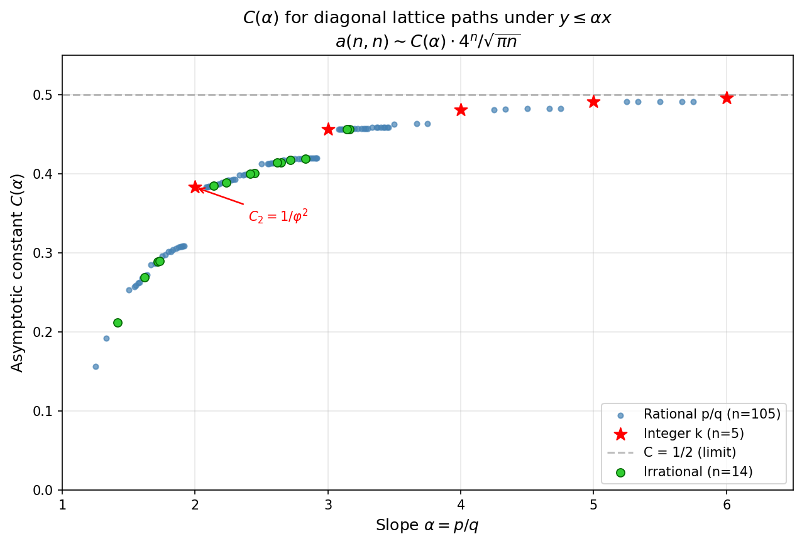
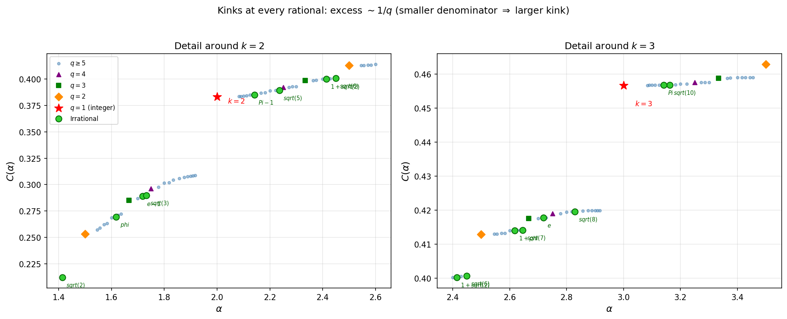

# Polynomial Structure of Beatty Ballot Rows

**Date:** 2026-04-11

## Motivation

Observation: `BeattyBallotCount[α, All, {p_k, q_{k-1}}]` — the row at height q_{k-1} between consecutive convergent numerators — is exactly a polynomial in position n.

Starting question: Is this polynomial form cleaner than the existing symbolic closed forms (Results 2, 3, 7)?

## Key Findings

### 1. Row at height j is always a degree-j polynomial

For any irrational α and any height j, the lattice path count at fixed height j is a polynomial of degree j in the position n. Verified for √2 up to degree 2378 (k=11).

### 2. Equivalence with Result 2 (uniform zone)

For j ≤ q₁, the polynomial is exactly the universal low-height formula in shifted coordinates:

```
P_j(n) = (n - wj)(n+1)(n+2)···(n+j-1) / j!
```

The Newton form (InterpolatingPolynomial output) is just the divided-difference representation of this known factored form. No new information.

### 3. Universality (window-independence)

P_j(n; α) is the same polynomial regardless of which convergent window [p_{k-1}, p_k] it is computed from. This makes it a well-defined canonical object attached to (α, j).

### 4. NOT an independent invariant

P_{q_k}(n; α) is uniquely determined by the partial quotients [a₀; a₁, ..., a_k], and conversely. But q_k + 1 coefficients encode only k numbers — it's a redundant (polynomial) encoding of the CF expansion to depth k. No compression, no new information beyond CF.

### 5. Zero/Ballot alternation at convergent points

P_{q_j}(p_j) equals:
- **B(p_j, q_j)** (ballot number) when p_j/q_j > α (convergent above)
- **0** when p_j/q_j < α (convergent below)

Forced by geometry: when the convergent undershoots α, the staircase hasn't reached height q_j at position p_j.

### 6. Factorization and root structure

- **j ≤ q₁:** all roots are integers (complete factorization over ℤ)
- **j > q₁:** one integer root at n = ⌈jα⌉ − 1 survives; remaining factor is generically irreducible with complex/irrational roots
- Exception: some (α, j) pairs retain all-integer roots beyond q₁ (e.g., √3 at j = q₂ = 3)

### 7. All-integer-root boundary

Empirical rule (verified for 8 irrationals):

**All roots of P_j(n; α) are integers iff j ≤ q₁ (when a₁ ≥ 2) or j ≤ q₂ (when a₁ = 1).**

| α | a₁ | Boundary | Integer-root heights |
|---|---|---|---|
| π | 7 | q₁ = 7 | {1, ..., 7} |
| √5 | 4 | q₁ = 4 | {1, ..., 4} |
| √2 | 2 | q₁ = 2 | {1, 2} |
| φ | 1 | q₂ = 2 | {1, 2} |
| √3 | 1 | q₂ = 3 | {1, 2, 3} |
| e | 1 | q₂ = 3 | {1, 2, 3} |

Algebraic proof for the a₁ = 1 extension at j = 2: discriminant = (2w+3)², always a perfect square. Proof for j up to q₂ is empirical.

### 8. Correction factorization between rational approximants

Comparing P_j(n; α) for two rationals [w; a₁, a₂] and [w; a₁, b₂] sharing a CF prefix:

**At j ≤ q₁: identical.** At j = q₁ + 1 + d, the correction factors completely into linear terms:

For [3;7,1] = 25/8 vs π (w=3, q₁=7, B₀ = B(25,8) = 420732):

| j | d | Correction = P_j(π) − P_j(25/8) |
|---|---|---|
| 8 | 0 | −B₀ |
| 9 | 1 | −B₀ · (n − 28) |
| 10 | 2 | −B₀/2 · (n − 31)(n − 24) |
| 11 | 3 | −B₀/6 · (n − 34)(n − 24)(n − 23) |
| 12 | 4 | −B₀/24 · (n − 37)(n − 24)(n − 23)(n − 22) |
| 13 | 5 | −B₀/120 · (n − 40)(n − 24)(n − 23)(n − 22)(n − 21) |
| 14 | 6 | −B₀/720 · (n − 43)(n − 24)(n − 23)(n − 22)(n − 21)(n − 20) |

Structure:
- **Leading coefficient:** −B(p₀+p₁, q₀+q₁) / d! (extends Result 3)
- **Moving root:** wj + 1, shifts by w with each step
- **Static roots:** −(p₁+2), −(p₁+1), −p₁, −(p₁−1), ... accumulate one per step

The complete factorization into linear terms goes beyond Result 3 (which only gave the leading coefficient and correction degree). Confirmed for [3;7,2] = 47/15 vs π: identical through j = 14, corrections begin at j = q₂ = 15 with the same hierarchical pattern.

### 9. Divergence structure across α

At height j, P_j distinguishes two irrationals iff their CFs differ within depth where q_k ≥ j:

```
j=1: φ == √2 == √3       (only w visible)
j=2: φ == √3 ≠ √2        (a₁ visible: φ,√3 have q₁=1; √2 has q₁=2)  
j=3: φ ≠ √3 ≠ √2         (a₂ visible: all three differ)
```

Each height peels off one more CF layer.

### 10. Diagonal lattice path family: paths under y ≤ kx

Using BeattyBallotCount[1/k, {n, n}] counts lattice paths from (1,0) to (n,n) staying under the staircase y = kx. This gives a family of integer sequences parametrized by k:

| k | Diagonal sequence | OEIS |
|---|---|---|
| 1 | 1, 2, 5, 14, 42, 132, 429, ... | **A000108** (Catalan) |
| 2 | 1, 3, 9, 31, 108, 391, 1431, 5319, ... | **A127927** |
| 3 | 1, 3, 10, 34, 121, 441, 1628, 6077, ... | **not in OEIS** |
| 4 | 1, 3, 10, 35, 125, 456, 1688, 6315, ... | **not in OEIS** |
| 5 | 1, 3, 10, 35, 126, 461, 1709, 6399, ... | **not in OEIS** |
| k→∞ | 1, 3, 10, 35, 126, 462, 1716, 6435, ... | C(2n-1, n-1) (unconstrained) |

**Key properties of A127927 (k=2):**
- Formula: a(n) = C(2n,n) − (−1)^(n−1) Σ C(3i,i)·C(i−n−1, n−1−2i)/(2i+1)
- The sum involves **A001764** = C(3n,n)/(2n+1) — the count of ternary trees
- Asymptotic: a(n) ~ 4^n / (φ² √(πn)) where φ is the golden ratio
- Main diagonal of triangle A062745

**Universal Newton coefficients:** For any two irrationals α₁, α₂ with the same CF prefix [0; a₁, ...], the diagonal sequences share Newton divided-difference coefficients up to the divergence point. For a₁ = 2 (including 1/√5, 1/√6, 1/√7, 1/e, and the rational 1/2), the shared prefix is:

```
1, 2, 2, 2, 9/8, 17/24, 203/720, 649/5040, 533/13440, 2581/181440, ...
```

These coefficients are α-independent — they encode the universal diagonal count under any staircase with slope ≥ 2.

### 11. Asymptotic constant: closed form for all k

The asymptotic behavior a_k(n) ~ C_k · 4^n / √(πn) (for k ≥ 2) has a universal characterization:

**C_k is the smallest positive root of (1−x)^{k+1} = 1−2x.**

Equivalently, factoring out x=0: C_k is the smallest positive root of p_k(x) where

```
p_k(x) = [(1-x)^{k+1} - (1-2x)] / x
```

These polynomials satisfy the recurrence **p_{k+1}(x) = (x−1)^k − p_k(x)** with closed form:

```
p_k(x) = [(x-1)^{k+1} + (-1)^{k-1}(2x-1)] / x
```

| k | Minimal polynomial of C_k | C_k | Verified |
|---|---|---|---|
| 1 | x² = 0 (double root) | 0 | Catalan: double root ⟹ n^{-3/2} |
| 2 | x² − 3x + 1 | 1/φ² = (3−√5)/2 | OEIS A127927 ✓ |
| 3 | x³ − 4x² + 6x − 2 | ≈ 0.45631 | brute-force ✓ (residual = 0) |
| 4 | x⁴ − 5x³ + 10x² − 10x + 3 | ≈ 0.48121 | predicted from recurrence |
| k→∞ | (1−x)^∞ = 0 ⟹ 1−2x = 0 | 1/2 | unconstrained ✓ |

Coefficients of p_k follow a modified Pascal pattern: all match C(k+1, j) except the constant term, which is k−1 instead of 1.

**TL;DR:** The smallest non-negative root of (1−x)^{k+1} = 1−2x transitions from a double zero (Catalan, n^{−3/2}) through 1/φ² (golden ratio) to 1/2 (unconstrained), unifying the entire family in one equation.

**Derivation status:** Equation discovered empirically (pattern in recurrence + brute-force identification). Algebraic proof of the recurrence is complete. Rigorous derivation from the GF/kernel method is outlined but not fully worked out — natural content for a paper.

**Significance:** k=1 (Catalan) is fundamental in combinatorics. k=2 (A127927) connects to ternary trees and φ. k ≥ 3 are apparently new sequences not in OEIS. The equation (1−x)^{k+1} = 1−2x unifies the entire family with a single closed-form characterization, exhibiting a phase transition at k=1.

## Conclusion

The row polynomial viewpoint (Findings 1–9) is largely a redundant repackaging of the CF expansion. However, the diagonal perspective (Findings 10–11) reveals a new combinatorial family parametrized by staircase slope k:
- k=1: Catalan numbers (A000108), asymptotic n^{-3/2}
- k=2: A127927, asymptotic constant 1/φ²
- k≥3: new sequences, asymptotic constant = smallest root of (1−x)^{k+1} = 1−2x
- k→∞: unconstrained, constant = 1/2

This is publishable: the family, the asymptotic equation, and the OEIS submission for k=3.

### 12. C(α) as a function of slope — continuity and integer excess

See also: [DIAGONAL-GENERALIZATIONS.md](DIAGONAL-GENERALIZATIONS.md) for non-integer slopes and ore_algebra analysis.

**Setup:** For any rational slope α = p/q ≥ 1, define a_α(n) = BeattyBallotCount[q/p, {n,n}] (paths from (1,0) to (n,n) under Floor[αx]). Then a_α(n) ~ C(α) · 4ⁿ / √(πn) for all α > 1.

**Survey:** C(α) computed numerically for 30 rational slopes (α from 5/4 to 6, with q ≤ 4), plus ~90 dense points around k = 2 and k = 3. Method: 200 terms via BeattyBallotCount, Richardson-averaged asymptotic estimate.



**Observation 1 — Global shape:** C(α) is monotonically increasing, concave, and converges to C = 1/2 from below as α → ∞. This matches the integer-slope limit: (1−C)^{k+1} = 1−2C gives C → 1/2 as k → ∞.

**Observation 2 — Integer slope excess:** Integer slopes k = 2, 3, 4, 5 all sit *above* the linear interpolation from their rational neighbors:

| k | C(k) | Interpolated | Excess | Relative |
|---|------|-------------|--------|----------|
| 2 | 0.3831 | 0.3443 | +0.0388 | +10.1% |
| 3 | 0.4567 | 0.4383 | +0.0185 | +4.0% |
| 4 | 0.4813 | 0.4726 | +0.0087 | +1.8% |
| 5 | 0.4913 | 0.4871 | +0.0042 | +0.8% |

The excess is systematic and decreasing with k.

**Observation 3 — Asymmetric gap structure:**

Path counts reveal the mechanism. Comparing staircases near k = 3:

| α | Rise sequence (one period) | Transfer matrices |
|---|---------------------------|-------------------|
| 11/4 = 2.75 | {**2**, 3, 3, 3} | L₂ · L₃ · L₃ · L₃ |
| 3 | {3} | L₃ |
| 13/4 = 3.25 | {3, 3, 3, **4**} | L₃ · L₃ · L₃ · L₄ |

For α = 13/4 (above 3): the first 3 steps are *identical* to α = 3 ({3,3,3}). Only the 4th step adds +1 extra height. Hence C(13/4) ≈ C(3) — a tiny bonus.

For α = 11/4 (below 3): the *first* step drops to 2 (instead of 3). This is an immediate bottleneck — the transfer matrix L₂ is 3×3 instead of 4×4, compressing the state space from the very start. Hence C(11/4) ≪ C(3) — a large penalty.

**Bottleneck interpretation:** At integer k, all steps are L_k (uniform size k+1). No step is a bottleneck. For α = k − 1/q, one step per period drops to L_{k−1} — an irreversible state-space compression at (q−1)/q of all positions. For α = k + 1/q, one step rises to L_{k+1} — a marginal expansion at 1/q of positions. The penalty of "one short step" dominates the bonus of "one tall step," creating the integer excess.

**Dense survey around k = 2 and k = 3** (93 additional points with q ≤ 12) reveals the local shape:



**Observation 4 — Kinks at EVERY rational, not just integers:**

Denominator-colored markers reveal a hierarchy: every rational p/q produces a local excess over its neighbors, with magnitude scaling as ~1/q:

| Denominator q | Marker | Relative excess | Examples |
|---------------|--------|----------------|----------|
| 1 (integer) | red star | +4 to +10% | 2, 3, 4, 5 |
| 2 | orange diamond | +1 to +4% | 3/2, 5/2, 7/2 |
| 3 | green square | +0.4 to +2% | 4/3, 5/3, 7/3, 8/3 |
| 4 | purple triangle | +0.3 to +1% | 7/4, 9/4, 11/4 |
| ≥ 5 | blue dot | < 0.3% | continuous-looking |

This is a **fractal** or **devil's staircase** signature: every rational is a point of non-smoothness, with the kink size governed by the denominator. The Farey/Stern-Brocot hierarchy of rationals is directly visible in the function C(α).

**Continuity status:** From the dense plot alone, it is not possible to distinguish between:
- (a) Continuous but nowhere differentiable (Weierstrass-type)
- (b) Continuous with a dense set of non-differentiability points (like the Thomae/popcorn function inverted)
- (c) Genuinely discontinuous at rationals

The bottleneck mechanism (see below) suggests (a) or (b): a small change in α changes the staircase at O(1/q) positions per period, which should produce a small (not zero) change in C. But a rigorous proof remains open.

**Observation 5 — Quantitative left-right asymmetry at α = 2:**

For α = 2 ± 1/n, we computed C(2 ± 1/n) for n = 2, ..., 20. The gaps are dramatically asymmetric:

| n | C(2) − C(2−1/n) | C(2+1/n) − C(2) | Ratio |
|---|------------------|------------------|-------|
| 3 | 0.098 | 0.016 | 6.3 |
| 5 | 0.082 | 0.006 | 14.1 |
| 10 | 0.075 | 0.0009 | 82 |
| 20 | 0.074 | 0.00004 | 1800 |

The left gap converges to a **constant** ≈ 0.074. The right gap decays as **~1/n²**. The ratio grows as ~n²/2. This means C(α) has a finite (nonzero) left derivative at α = 2 but a zero right derivative — a **cusp** or **one-sided kink**.

### Observation 6 — Egyptian fraction explanation of the asymmetry

The CF–Egypt bijection (see `docs/papers/egyptian-fractions-telescoping.tex`) provides a structural explanation. For α near an integer k, compare the Egyptian decomposition of 1/α:

**α = k − 1/n (below):** 1/α = n/(kn−1), CF = [0; k−1, 1, n−k+1, ...]. The CF has **3+ partial quotients**, yielding **2+ Egyptian tuples**. The first tuple overshoots to a partial sum of 1/(k−1), then subsequent tuples correct downward. Concretely for k = 2:

```
1/α = n/(2n−1),  CF = [0; 1, 1, n−2]
Egypt = {(1,1,1,1), (2, 2n−3, 1, 1)}
  S₁ = 1/2        ← overshoots 1/α ≈ 1/2 − ε
  S₂ = n/(2n−1)   ← corrected
```

**α = k + 1/n (above):** 1/α = n/(kn+1), CF = [0; k, n]. The CF has only **2 partial quotients**, yielding a **single Egyptian tuple**. No intermediate overshoot:

```
1/α = n/(2n+1),  CF = [0; 2, n]
Egypt = {(1, 2, 1, n)}
  S₁ = n/(2n+1)   ← directly on target
```

**The connection:** The number of Egyptian tuples determines the staircase complexity:
- **2+ tuples** (approach from below): the CF prefix [0; 1, 1, ...] forces the first rise to be **k−1** instead of k. This creates an immediate bottleneck — the transfer matrix L_{k−1} is one dimension smaller than L_k, compressing the state space from the first step.
- **1 tuple** (approach from above): the CF starts with [0; k, ...], preserving the correct first rise of k. The bonus rise of k+1 comes at the end of the period, where paths to the diagonal (n,n) don't use the extra height (y = n ≪ kn), making it asymptotically invisible.

This generalizes to **every** rational p/q: approaching from below adds CF partial quotients (= more Egyptian tuples = more bottleneck layers), while approaching from above preserves the CF length. The kink magnitude ~1/q follows because the bottleneck L_{min−1} appears once per period of length q.

**Status:** 🔬 NUMERICALLY VERIFIED (110 slopes + 19 asymmetry points at α=2). The Egyptian fraction mechanism is qualitative but fully consistent with all data. Rigorous formalization (connecting tuple count to spectral gap of transfer matrix) remains open.

### ⏸️ OPEN QUESTION: Does C(α) encode all of α?

Two competing viewpoints, neither proven:

**Viewpoint A (C is just a scalar):** C(α) assigns one real number to each α. The convergent-endpoint framework BeattyBallotCount[α, {p_k, q_k}] captures the *full* CF expansion of α — a sequence of transfer matrices, not just one number. The diagonal (n,n) is a projection that loses information. Different α could share the same C.

**Viewpoint B (C is a faithful encoding):** C(α) is monotonically increasing (numerically verified). A monotone function is injective, so C(α₁) ≠ C(α₂) whenever α₁ ≠ α₂. The fractal kink hierarchy — with kink size ~1/q at every rational p/q — *is* the Stern-Brocot tree, read off from the graph of C. For irrational α, the local behavior of C near α (approached through its rational approximants) encodes the full CF expansion. The limit n → ∞ does not blur the structure — it *integrates* over infinitely many periods of the staircase, converging to a well-defined constant that reflects the entire Sturmian word. In this view, C is analogous to Minkowski's question-mark function ?(x): monotone, continuous, with fractal structure controlled by CF denominators.

**What would resolve this:**
- **For B:** Prove strict monotonicity of C(α). Then injectivity follows. The kink hierarchy would then be a complete encoding of α.
- **Against B:** Find α₁ ≠ α₂ with C(α₁) = C(α₂). This seems unlikely given the data but is not excluded.
- **Deeper:** Even if C is injective, the convergent framework might reveal structure (e.g., spectral gaps, Lyapunov exponents of transfer matrices) that C alone does not make accessible. Injectivity ≠ practical decodability.

**Note:** For α < 1, the staircase Floor[αx] eventually falls below the diagonal, so no paths to (n,n) exist and C(α) = 0. The diagonal approach covers only α > 1; the full range requires the substitution α ↔ 1/α or the convergent framework.

**Status:** ⏸️ OPEN — both viewpoints are consistent with the data. Neither has a proof.

## Open Threads

- **Formalize the CF→Egypt→bottleneck chain:** Prove that the number of Egyptian tuples for 1/α controls the modulus of continuity of C(α). The spectral gap of the period transfer matrix should be expressible in terms of tuple parameters.
- **C(α) at irrationals:** 14 irrational points (π, e, φ, √k) computed — all sit smoothly on the rational curve. For irrationals with bounded partial quotients (e.g., φ), C should be "smooth." For irrationals with unbounded quotients (e.g., e = [2; 1, 2, 1, 1, 4, 1, 1, 6, ...]), the growing quotients might create visible structure.

- **Rigorous derivation of (1−x)^{k+1} = 1−2x** from GF/kernel method (paper-ready)
- **ODE factorization:** k=2 ODE factors as [2, 1, 1]. Does k=3 factor similarly? Does the pattern generalize?
- **Slope 3/2 ODE:** Minimal ODE needed (500 terms insufficient for ore_algebra ODE guess). Recurrence order 12 (deg 50) found.
- **OEIS submission** for k=3 sequence (500 terms computed, combinatorial description ready)
- Algebraic proof of all-integer-root boundary for a₁ = 1, j > 2 (up to q₂)
- Explicit formula for a_k(n) generalizing A127927's formula with Fuss-Catalan corrections

## Scripts

All in `scripts/` subfolder. Key scripts:

**Polynomial structure (Findings 1–9):**
- `poly_check.wl` — initial verification: polynomial = Result 2
- `poly_convergent_scan.wl` — degree check up to k=11
- `poly_universal.wl` — universality test + evaluation at convergent numerators
- `poly_compare_alpha.wl` — comparison across φ, √2, √3, √5, e
- `poly_integer_roots.wl` — all-integer-root boundary scan (8 irrationals)
- `poly_rational_compare.wl` — rational convergent comparison, coefficient identity
- `poly_corrections_and_sqfree.wl` — correction factorization between CF levels

**Diagonal family (Findings 10–12):**
- `poly_diagonal_sweep.wl` — diagonal sequences under y ≤ kx for k=1..7
- `poly_diagonal.wl` — Newton coefficient comparison across α (universal prefix)
- `generate_seq_3_2.wl` — generate 500-term sequences for slopes 2, 3, 3/2
- `survey_C_alpha.wl` — C(α) survey for 30 rational slopes
- `survey_C_detail.wl` — dense C(α) survey around k=2, k=3 (~90 points)
- `staircase_comparison.wl` — rise sequences and path counts near k=3
- `asymmetry_near_2.wl` — quantitative left-right asymmetry at α=2
- `survey_C_irrational.wl` — C(α) for 14 irrational slopes (π, e, φ, √k)
- `plot_C_alpha.py` — plot C(α) survey with denominator coloring and irrationals (matplotlib)

**ore_algebra analysis (Python, requires venv_ore_algebra):**
- `ore_guess_integer.py` — guess recurrences for k=2, k=3
- `ore_analyze_k2.py` — ODE analysis: singularities, local basis, transition matrix
- `ore_analyze_k3.py` — ODE analysis for k=3
- `ore_guess_3_2.py` — guess recurrence for slope 3/2 (order 12, deg 50)
- `ore_factor.py` — ODE factorization (k=2: [2,1,1])
